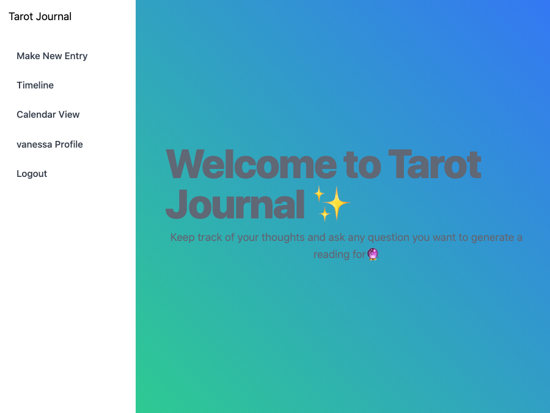
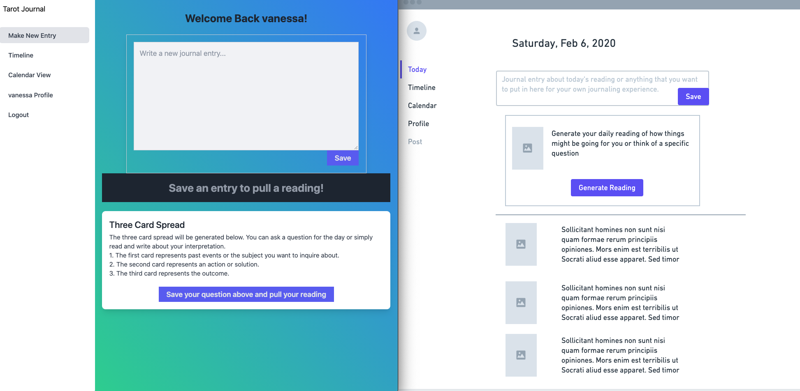
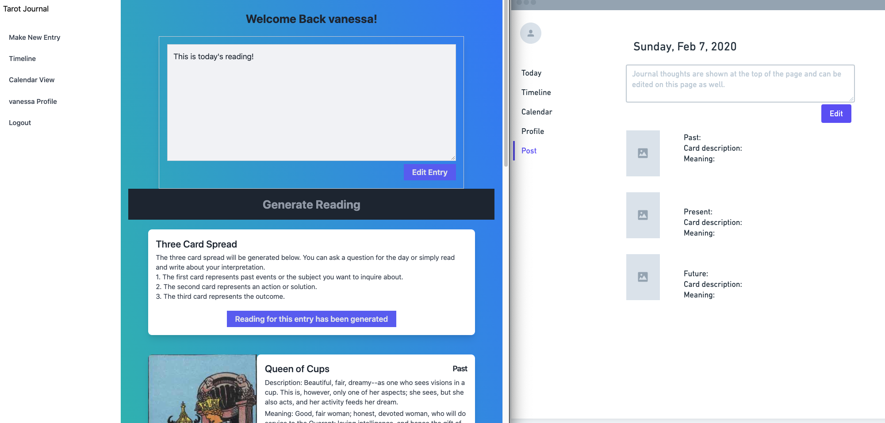
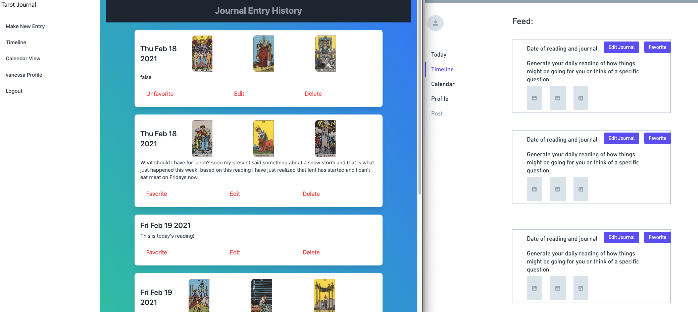

This is a [Next.js](https://nextjs.org/) project bootstrapped with [`create-next-app`](https://github.com/vercel/next.js/tree/canary/packages/create-next-app).

## Getting Started

First, run the development server:

```bash
npm run dev
# or
yarn dev
```

Open [http://localhost:3000](http://localhost:3000) with your browser to see the result.


# Approach/Methodology
This app was created as a personal journal app that allows the user to pull a three card reading for reflection. On the backend to generate a reading of random cardsI used an API (https://rws-cards-api.herokuapp.com/api/v1/cards/random?n=3) from [https://github.com/ekelen/tarot-api](https://github.com/ekelen/tarot-api). The user can easily make, edit, favorite and delete any entry as well as make an entry without a reading. On the backend I wanted to make it easier to expand the app for future stretch goals by making the routes easy to follow.

The frontend has a simple design but it is easy to follow and is also very open to adding my stretch goals. For the purpose of the first version the goal was to be able to make and view all entrys and easily.

# Home page after user can be seen if you are logged in or not


# Link to Deployed App
Link to come

# Link to Backend Repo
[Here](https://github.com/regularvanessaperson/tarot-journal-backend) is a link to the backend
# Wireframes
[Here](https://whimsical.com/tarot-journal-42KwyjgZVAM2FWca9JoNDe) is a link to the wireframes that can be viewed as they are updated. I didn't change the original layout that I was going for below are side by side images of the pages and the initial wireframes.





# User Stories
| As a user, I want to be able to...|
|-|
|Write a write an entry with or without a reading|
|View all entrys by date|
|Edit, favorite and delete entrys|
|View a calendar marking days that I made a journal entry|
|View favorite posts feed|


## Fetching Data
- Axios: allows us to make calls to send data to and retrieve data from our backend. We are also investigating integrating a Twitter API into our app.


## Architecture
Backend: 
- MongoDb
- Express
Frontend:
- React
- Node
- Nextjs


## Styling
- tailwindcss
- react-day-picker: [https://react-day-picker.js.org/](https://react-day-picker.js.org/)

# Installation Instructions
- Fork & clone this repo
- cd into local directory and `npm install` to install dependencies

# Problems/Challenges
- Nextjs is really nice to work with because the server side rendering will prepopulate components and make it faster to navigate the app. My downfall was that I completely built my backend first before learning Nextjs. If I had learned from the begining I could have integrated the Nextjs/Mongodb where I could have set up the routes on the frontend to fetch the data. Because of this I had a really hard time getting use to the file structure and took longer than I should have to complete the MVP.
- There were issues with re-rendering the nav bar where even if logged in the nav bar would not update until the page is manually refreshed. This is also the case for the delete and favorite buttons where even though I use the router.push to transition the components only update after a while or if the page is refreshed manually.

# Future Goals for this Tarot Journal
- The user profile needs to be updated to include notes for the user, I built the backend for this but was not able to complete on the front end at this time. The notes are like sticky notes for the user to have aside from the journal entrys.
- I have also already begun the route to render a 5 card reading, next steps are to give the option to render a 5 card reading instead of the 3 card reading.
- Since this is a personal journal I wanted to give the user the oportunity to customize so I want to incorporate an input so the user can add their own background to the app since the layout is very simple.

